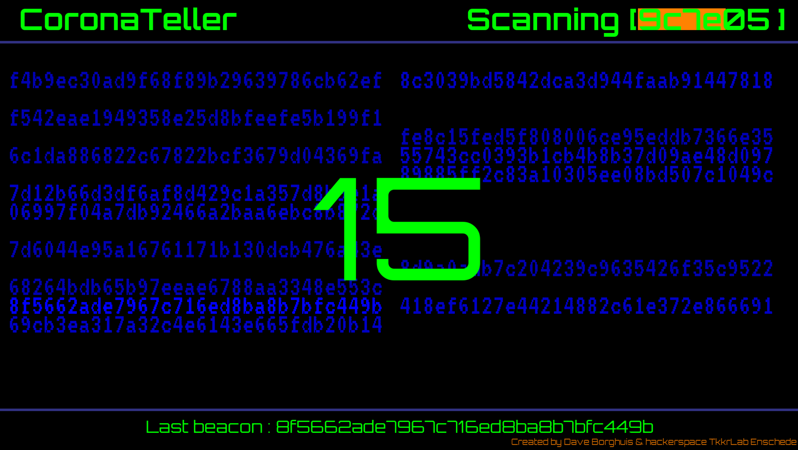

# CovidTeller

## Dutch
Vanaf 1 september is in Nederland de CoronaMelder app beschikbaar. Deze app stuurt bluetooth beacons uit die met de juiste apparatuur en software te zien zijn. Met CovidTeller maakt Dave Borghuis ism hackerspace TkkrLab uit Enschede deze beacons zichtbaar.

De CoronaMelder is gebaseerd op het DP-3T protocol, voor meer (technische) informatie zie ook [mijn blog](http://daveborghuis.nl/wp/corona-app_2020_04_12/)

De CoronaTeller houd geen gegevens bij, het laat alleen de beacons zien die de laatse 15 minuten zijn gezien.

# Installation

## Needed hardware / software
- Raspberry 4 (ivm bleutooth optie)
- Raspberry Pi OS (32-bit) with desktop and recommended software, version May 2020
- python 3 with the following libarys : pygame, pybluez